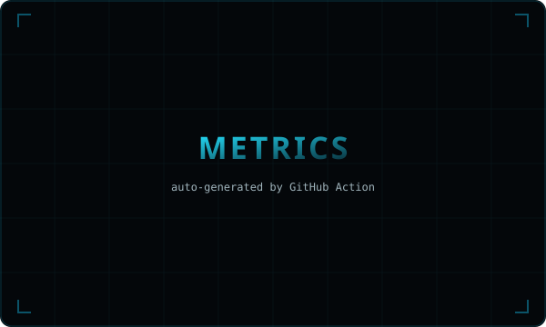
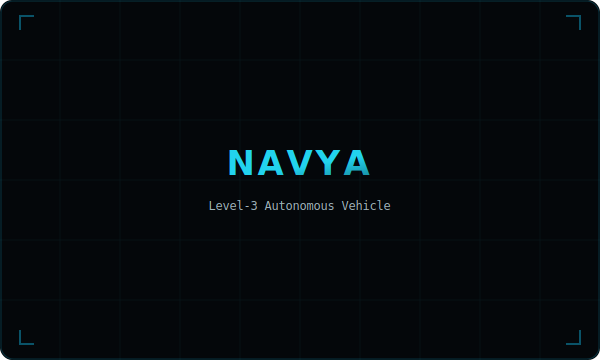
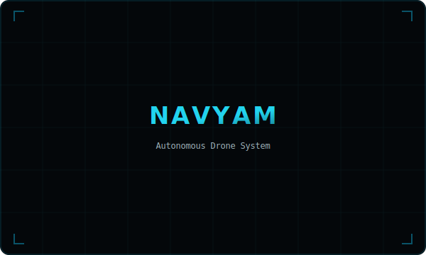

<!-- ═══════════════════════════════════════════════════════════════
     SUJAL NEGI · Autonomous Systems & Mechanical Engineer
     Banner is an animated SVG — LiDAR radar sweeps, wordmark fades in,
     terminal boots line by line. Renders live on GitHub.
     ═══════════════════════════════════════════════════════════════ -->

<div align="center">



<br/>

<a href="https://linkedin.com/in/sujalnegi128005"></a>
<a href="mailto:offsujal128005@gmail.com"></a>
<a href="https://github.com/sujal128005"></a>


</div>

<br/>

## `> whoami`

```txt
Sujal Negi — B.Tech Mechanical Engineering, IIITDM Kurnool (2023–2027)
Building Level-3 autonomous vehicles & industrial drones.
Interests: LiDAR · SLAM · Computer Vision · Mechatronics · Control Systems
Also: Published author of 10 books (pseudonym: alfaazsujalke)
```

<br/>

## `> arsenal`

<div align="center">

<!-- Languages -->


&nbsp;&nbsp;
<!-- Autonomy -->


&nbsp;&nbsp;
<!-- CAD / Sim -->


&nbsp;&nbsp;
<!-- Data / Tools -->


</div>

<br/>

## `> live grid`  <sub><sub>_auto-synced from GitHub_</sub></sub>

<div align="center">


</div>

<!-- Auto-generated by GitHub Action (lowlighter/metrics) on a schedule -->
<div align="center">

</div>

<br/>

## `> deployed`  <sub><sub>_the flagship builds_</sub></sub>

<table>
<tr>
<td width="50%" valign="top">



**Navya — Level-3 Autonomous Vehicle**
Leading a 19-member team building a self-driving vehicle. LiDAR-based SLAM, lane detection, and control systems.
`Python` `OpenCV` `LiDAR` `SLAM`

</td>
<td width="50%" valign="top">



**Navyam — Autonomous Drone System**
8-member build for industrial monitoring. PX4 offboard control, a lawnmower search algorithm for 20×20m surveillance, and self-docking recharge (0.5m precision in Gazebo).
`ROS 2` `PX4` `Gazebo`

</td>
</tr>
</table>

<br/>

## `> activity pulse`  <sub><sub>_updates itself_</sub></sub>

<div align="center">

</div>

<br/>

## `> field record`

<div align="center">

| | |
|---|---|
| **Club Coordinator** | DataWorks Club (AI/ML & Data Science), IIITDM Kurnool — 600+ participants trained, 40% engagement lift |
| **Institute SPOC** | Inter-IIIT Tech Meet "Udbhav" — coordinated with 23 SPOCs, ran a hackathon for 350+ students |
| **Semi-Finalist** | UPAKRITIN Hackathon — NavIC-based crowd management |
| **Certified** | IBM Data Science Fundamentals · Google Analytics (98.25%) · Agile & Scrum (84%) |
| **Recognition** | Top 10 Finalist AWA 2024 · #88 in India's Top Poets (S7 Poetry) |
| **Published Author** | 10 books, English & Hindi literature (pen name: alfaazsujalke) |

</div>

<br/>

## `> trophies`

<div align="center">

</div>

<br/>

<div align="center">
<sub>Building at the intersection of <b>mechanical design</b> and <b>autonomous intelligence</b>. From CAD to code to the road.</sub>
<br/>

</div>
