<!--
  ┌──────────────────────────────────────────────────────────────────────┐
  │  GENERATED FILE. Edit templates/README.template.md, not README.md.     │
  │  Content comes from sujalnegi.tech + the GitHub API and is rebuilt by  │
  │  .github/workflows/refresh-profile.yml every 6 hours.                  │
  └──────────────────────────────────────────────────────────────────────┘
-->

<a href="https://sujalnegi.tech"></a>

 

<a href="https://sujalnegi.tech/#s-about">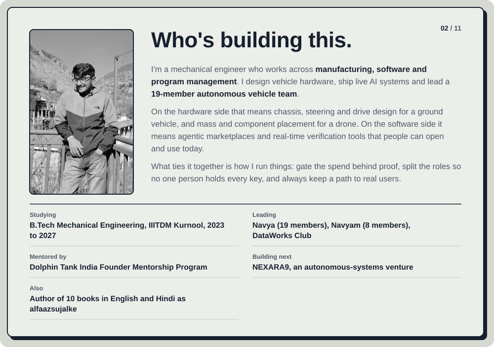</a>

**Building next:** [NEXARA9](https://nexara9.me/), an autonomous-systems venture · **Also:** Author of 10 books in English and Hindi as [alfaazsujalke](https://www.instagram.com/sujal128005/)

 

<a href="https://limen-peqe.onrender.com">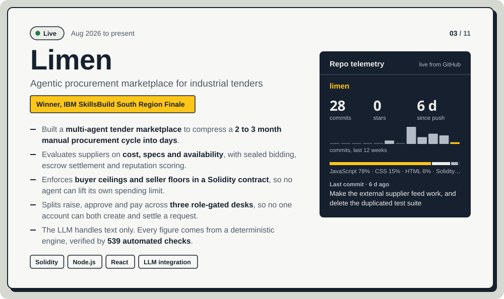</a>
 

 

<a href="https://khata-avs8.onrender.com/login">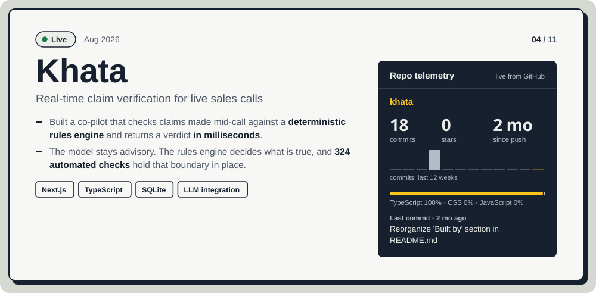</a>
 

 

<a href="https://sujalnegi.tech/Navyam.html">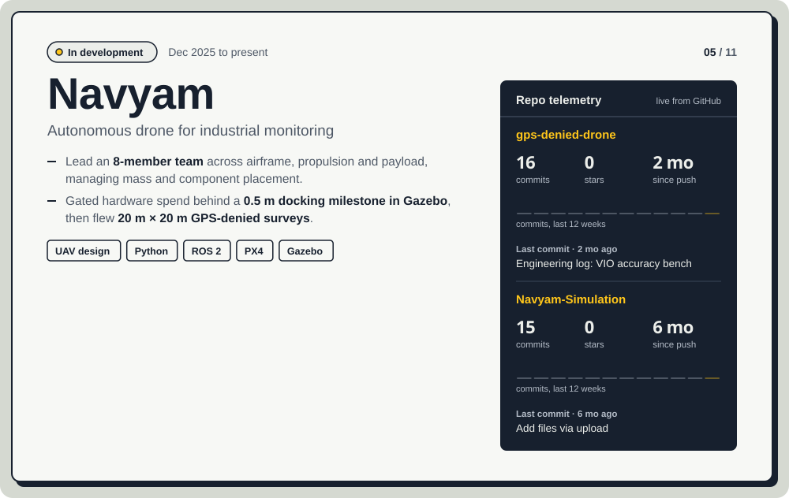</a>
 

 

<a href="https://sujalnegi.tech/Navya.html">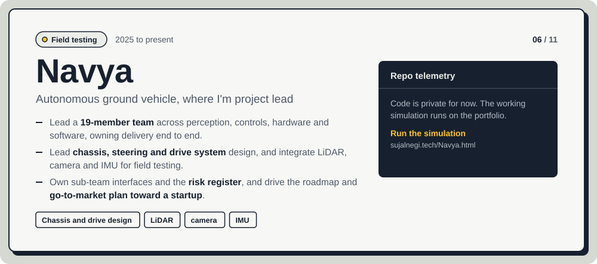</a>
 

 

<a href="https://sujalnegi.tech/#s-traction">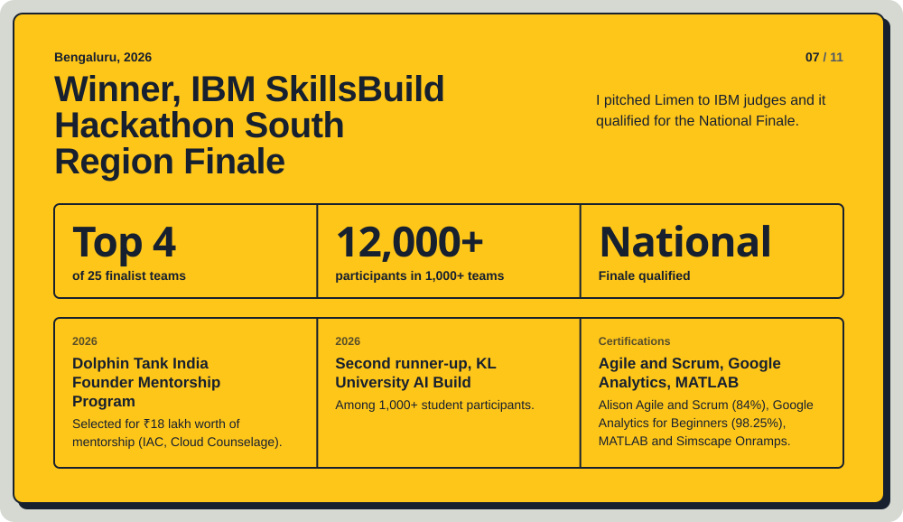</a>

 

<a href="https://github.com/sujal128005?tab=repositories"></a>

 

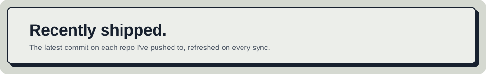

_Filled in on the first sync._

 

<a href="https://sujalnegi.tech/#s-teams">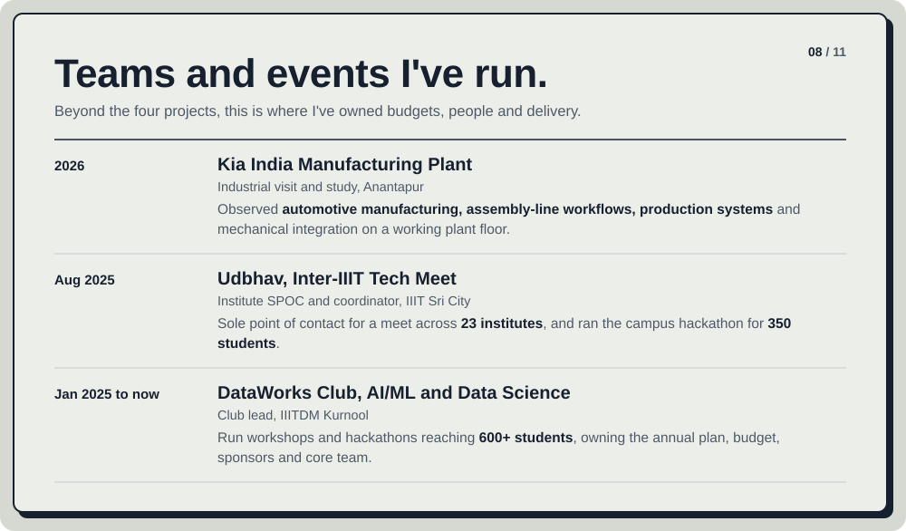</a>

  

<a href="https://sujalnegi.tech/#s-playbook">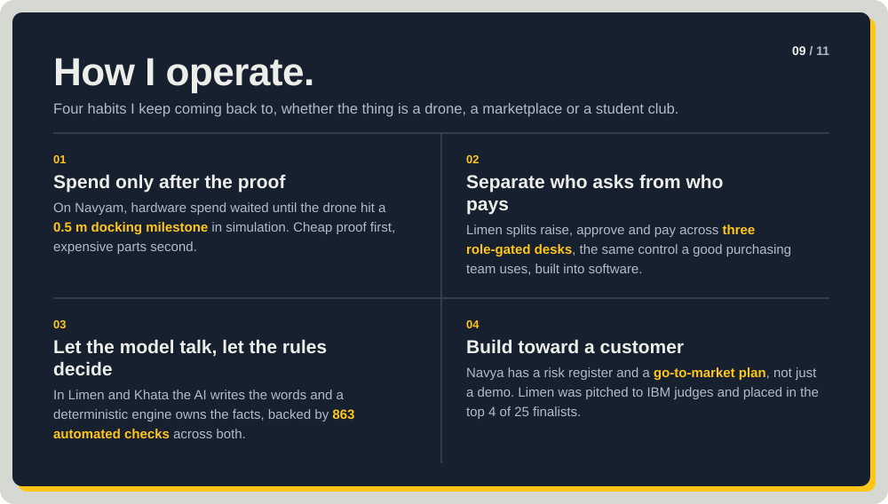</a>

  

<a href="https://sujalnegi.tech/#s-toolkit">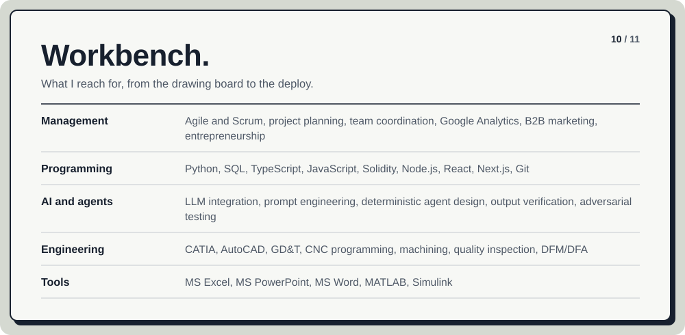</a>

  

<a href="mailto:offsujal128005@gmail.com">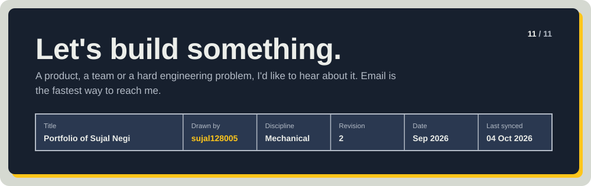</a>

  

Mirrors <a href="https://sujalnegi.tech">https://sujalnegi.tech</a> · auto-synced pending first run · rebuilt by GitHub Actions

